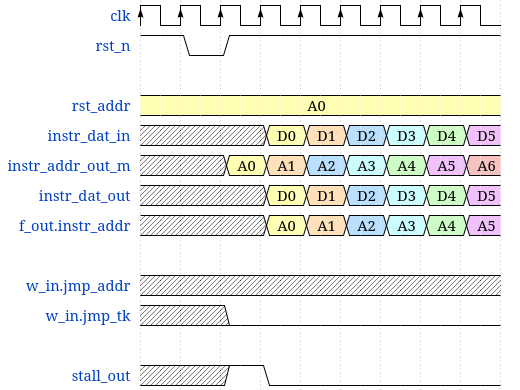

# ststp
## a RISC-V based processor implementation

Currently under construction.

In progress: physical implementation on Artix A7 100-T FPGA board, finalized test suite.

# Device Overview

## General Description

Ststp is a four stage (fetch, decode, execute, writeback) pipelined
RISC-V processor utilizing a Harvard architectural design. It currently
implements the base RV32IM standard, and hopefully the bit manipulation extension soon.

## Top-Level Block Diagram

## Memory

For now, I've chosen to simplify the memory model, with a one cycle
read/write. It simplifies timing complexity. I've also chosen to
separate instruction memory and data memory, as it makes the
implementation clearer.

## Stages

The fetch stage gets instruction from instruction memory. Passes along program
counter and raw instruction to decode. Always assumes branch is not
taken, static prediction.

*expected waveform after reset*

*expected waveform after jump*

The decode stage gets raw instruction and raw instruction address (pc) from fetch
stage. Passes along decoded instruction, decoded immediate, register
indexes and data, and instruction address to execute stage. The register
file is instantiated in this stage. Gets data to write to register file
from writeback stage.

*expected operation for decode*

The execute stage gets decoded operation from the execute stage, and necessary
data as well as address. Performs operation. Passes along the modified
data and register indexes to the writeback stage, and whether or not a
branch was taken if it was a branch/jump instruction. Passes along the
calculated load/store address, as well as data for store, to the data
memory in advance so the data memory can be fed to the writeback stage
at the appropriate posedge.

The writeback stage gets modified data, register indexes, branch address, and
branch taken from execute stage. Gets load data from data memory. Passes
along data memory, modified data, and register indexes to the register
file in the decode stage. Passes along branch address and branch taken
to the fetch stage. It should also pass along a flush signal to all
stages when it finds a branch is taken, as the static prediction always
predicts for a branch not taken (a.k.a next_pc = cur_pc + 4 bytes).

Floating point ops, Control/status registers currently aren't implemented. ECALL and EBREAK
aren't implemented.
